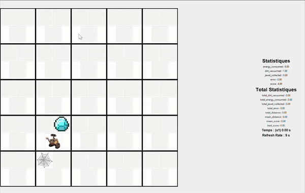

# Vacuum Agent



## About
This project is a demonstration of the implementation of an vacuum agent based on the Belief Desire Intention (BDI) formalism with the A* algorithm in Python. It was made in collaboration with [Justin Aubin](https://github.com/Justin-Aubin) for a course in Artificial Intelligence at UQAC.

## Options

To choose the exploration strategy, you have to open the file "config.py" and choose the mode "informed" or "not_informed" in the key "mode".
- Informed uses A* algorithm with a custom heuristic close to what we call a "heatmap". The closer you get to an area dense with dust and jewelry, the lower the cost.
- Non-informed simply uses Breadth-First Search with Manhattan distance heuristic.

## How to use
```bash
# Clone this repository
$ git clone https://github.com/Wazzabeee/vacuum-agent/

# Go into the repository
$ cd vacuum-agent

# Install requirements
$ pip3 install -r requirements.txt

# Run the app
$ python main.py
```
